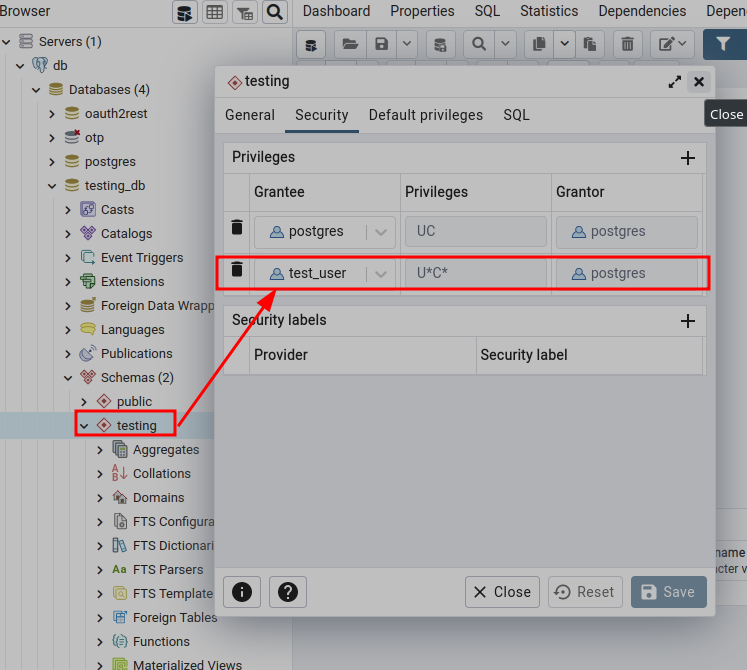

# NOTES

## Pre Requisites

### Postgres

- [SDB:PostgreSQL - openSUSE Wiki](https://en.opensuse.org/SDB:PostgreSQL)

install client for psql, createuser, createdb etc

```shell
$ sudo zypper in postgresql
$ psql --version
psql (PostgreSQL) 14.1
```

## Bootstrap project

opted to enter inside container

```shell
$ docker exec -it db bash
# create user
$ createuser -P test_user
Enter password for new role: 
Enter it again: 
createuser: error: could not connect to database template1: FATAL:  role "root" does not exist
```

- [Createuser: could not connect to database postgres: FATAL: role &quot;tom&quot; does not exist](https://stackoverflow.com/questions/16973018/createuser-could-not-connect-to-database-postgres-fatal-role-tom-does-not-e)

```shell
# now it works
$ createuser -P test_user -U postgres
Enter password for new role: 
Enter it again: 

# create db
$ createdb -O test_user testing_db -U postgres

# exit container
exit

# copy scheme
$ docker cp sql/schema.sql db:/tmp
# enter container
$ docker exec -it db bash

$ psql -f /tmp/schema.sql testing_db -U postgres
psql:/tmp/schema.sql:1: NOTICE:  schema "testing" does not exist, skipping
DROP SCHEMA
CREATE SCHEMA
CREATE TABLE
```

> This step can be repeated and clears the database as it drops and recreates the schema testing which is used within the database.

use pgAdmin to grant user on **testing schema**



```sql
ALTER TABLE IF EXISTS testing.users OWNER to postgres;
GRANT ALL ON TABLE testing.users TO postgres;
GRANT ALL ON TABLE testing.users TO test_user;
```

```shell
# create .env file:
$ code .env
```

```shell
SERVER_ADDR=127.0.0.1:8080
PG.USER=test_user
PG.PASSWORD=testing
PG.HOST=127.0.0.1
PG.PORT=5432
PG.DBNAME=testing_db
PG.POOL.MAX_SIZE=16
```

```shell
# run the server:
$ cargo run
```

Using a different terminal send an HTTP POST request to the running server:

```shell
# ping
$ curl -k -X GET https://127.0.0.1:8443/ping \
  -H 'Content-Type: application/json' \
  | jq

$ curl -k -X POST https://127.0.0.1:8443/api/users \
  -H 'Content-Type: application/json' \
  -d '{"email": "ferris@thecrab.com", "first_name": "ferris", "last_name": "crab", "username": "ferreal"}' \
  | jq

$ curl -k -X POST https://127.0.0.1:8443/api/users \
  -H 'Content-Type: application/json' \
  -d '{"email": "rustris@thecrab.com", "first_name": "rustris", "last_name": "crab", "username": "rustris"}' \
  | jq

$ curl -k -X GET https://127.0.0.1:8443/api/users \
  -H 'Content-Type: application/json' \
  -d "{\"condition\": \"users.email = 'rustris@thecrab.com'\"}" \
  | jq

# get user
$ curl -k -X GET https://127.0.0.1:8443/api/users/ferreal \
  -H 'Content-Type: application/json' \
  | jq

# delete user
$ curl -k -X DELETE https://127.0.0.1:8443/api/users/rustris \
  -H 'Content-Type: application/json' \
  | jq
```

## Convert a collection to a Result

- [How do you convert a collection to a Result in rust and actix to return data from postgres?](https://stackoverflow.com/questions/71189663/how-do-you-convert-a-collection-to-a-result-in-rust-and-actix-to-return-data-fro)

```rust
  // more applicable for SELECTs
  .ok_or(MyError::NotFound)
}
```
